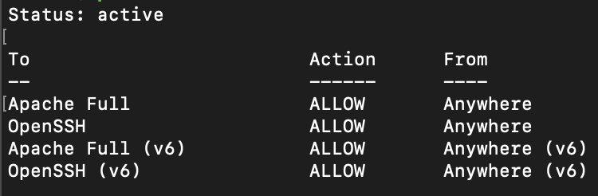
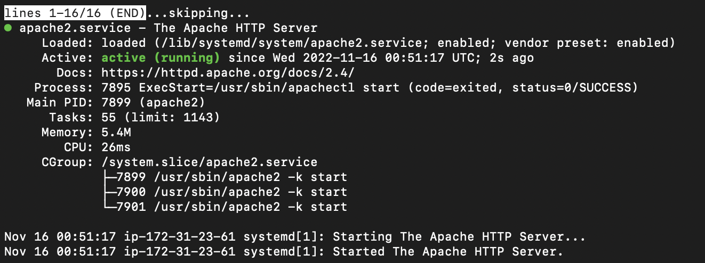

# Server Setup Example

Below are the basic steps needed to setup the server.

To access the server remotely using SSH via terminal or Command Prompt, run the command below:

```
ssh -i <your-server-key-file> <your-server-user>@<your-server-public-ip>
```

Example:

```
ssh -i key.pem ubuntu@123.12.12.12
```

## Web Server Installation

### 1. Nginx

- Install Nginx
  ```
  sudo apt install nginx
  ```
- Adjusting the firewall. The web server firewall is disabled by default. To enable the firewall, run the command below.
  ```
  sudo ufw enable
  ```
- Allow connections for port 80 (normal, unencrypted web traffic), port 443 (TLS/SSL encrypted traffic) and port 22 (default port for SSH).
  ```
  sudo ufw allow 'Nginx Full'
  ```
  ```
  sudo ufw allow 'OpenSSH'
  ```
- Verify the firewall changes by running the command below

  ```
  sudo ufw status
  ```

  The output is should looking like below

   

- Check whether the web server is already running or not.

  ```
  sudo systemctl status nginx
  ```

  You should see something like this:

   

- If it is already running, go to browser and enter the server's public IP address into the browser's address bar. You should see the default Nginx landing page.

  ```
  http://<your-server-public-ip>
  ```

  Run the command below to get your server's public IP:

  ```
  curl -4 icanhazip.com
  ```

- Next, create a new document root directory
  ```
  sudo mkdir -p /var/www/<your-project-name>
  ```
- Assign ownership to the created directory
  ```
  sudo chown -R $USER:$USER /var/www/<your-project-name>
  ```
- Grant permission to access the directory
  ```
  sudo chmod -R 755 /var/www/<your-project-name>
  ```
- Create a sample html page for the site

  ```
  sudo nano /var/www/<your-project-name>/index.html
  ```

- Copy and paste the code below into index.html file. Then, save and close the file by pressing `Ctrl+X`

  ```
  <html>
    <head>
        <title>Welcome!</title>
    </head>
    <body>
        <h1>Hello, World!</h1>
    </body>
  </html>
  ```

- Change the root path at `/etc/apache2/sites-available/default`

  ```
  sudo nano /etc/nginx/sites-available/default
  ```

  Change the document root path from `/var/www/html` to `/var/www/<your-project-name>`

  ```{.text .no-copy}
  ...
  root /var/www/<your-project-name>;
  ...
  ```

- **(OPTIONAL)** Enable `server_names_hash_bucket_size` in nginx.conf file to avoid possible hash bucket memory problem

  ```
  sudo nano /etc/nginx/nginx.conf
  ```

  Find the `server_names_hash_bucket_size` directive and remove the '#' symbol to uncomment the line. Save and close the file by pressing `Ctrl+X`

- Run the command below to make sure there are no syntax errors in any of the Nginx files

  ```
  sudo nginx -t
  ```

- To enable the changes, restart Nginx.

  ```
  sudo systemctl restart nginx
  ```

- To test the results, go to browser and point to your server's public IP address. You should see the content that you have created.

### 2. Apache

- Install Apache
  ```
  sudo apt install apache2
  ```
- Adjusting the firewall. The web server firewall is disabled by default. To enable the firewall, run the command below.
  ```
  sudo ufw enable
  ```
- Allow connections for port 80 (normal, unencrypted web traffic), port 443 (TLS/SSL encrypted traffic) and port 22 (default port for SSH).
  ```
  sudo ufw allow 'Apache Full'
  ```
  ```
  sudo ufw allow 'OpenSSH'
  ```
- Verify the firewall changes by running the command below

  ```
  sudo ufw status
  ```

  The output should looking like below

   

- Check whether the web server is already running or not.

  ```
  sudo systemctl status apache2
  ```

  You should see something like this:

   

- If it is already running, go to browser and enter the server's public IP address into the browser's address bar. You should see the default Apache landing page.

  ```
  http://<your-server-public-ip>
  ```

  Run the command below to get your server's public IP:

  ```
  curl -4 icanhazip.com
  ```

- Go to `/var/www/` and create a new project folder
  ```
  sudo mkdir /var/www/<your-project-name>
  ```
- Assign ownership to the created directory and grant read, write, execute permissions to owner
  ```
  sudo chown -R $USER:$USER /var/www/<your-project-name>
  ```
  ```
  sudo chmod -R 755 /var/www/<your-project-name>
  ```
- Create sample `index.html` file
  ```
  sudo nano /var/www/<your-project-name>/index.html
  ```
- Copy and paste the code below into `index.html` file. Close and save the file.

  ```
  <html>
    <head>
        <title>Welcome!</title>
    </head>
    <body>
        <h1>Hello, World!</h1>
    </body>
  </html>
  ```

- Go to `/etc/apache2/sites-available` and change the root path in `000-default.conf` file
  ```
  cd /etc/apache2/sites-available
  sudo nano 000-default.conf
  ```
  Change the document root path from `/var/www/html` to `/var/www/<your-project-name>`
  ```{.text .no-copy}
  ...
  DocumentRoot /var/www/<your-project-name>
  ...
  ```
- Test for configuration errors
  ```
  sudo apache2ctl configtest
  ```
- To reflect the changes, restart Apache
  ```
  sudo systemctl restart apache2
  ```

## Setting Up Virtual Host or Server Block in Web Server

By default, web server enable only one virtual host or also known as server block. In order to host multiple sites in one server, we can create multiple virtual host.

- Create the directory for your project as follows
  ```
  sudo mkdir /var/www/<your-project-name>
  ```
- Assign ownership to the created directory and grant read, write, execute permissions to owner

  ```
  sudo chown -R $USER:$USER /var/www/<your-project-name>
  ```

  ```
  sudo chmod -R 755 /var/www/<your-project-name>
  ```

- Create a virtual host file with the proper directives so that Apache may deliver this content.

  **Apache:**

  Create new configuration file at `/etc/apache2/sites-available`

  ```
  sudo nano /etc/apache2/sites-available/<your-project-name>.conf
  ```

  Paste the code below into that file. Then, press `Ctrl+X` to save and close the file

  ```
  <VirtualHost *:80>
      ServerAdmin webmaster@localhost
      ServerName <your-domain-name>
      ServerAlias www.<your-domain-name>
      DocumentRoot /var/www/<your-project-name>
      ErrorLog ${APACHE_LOG_DIR}/error.log
      CustomLog ${APACHE_LOG_DIR}/access.log combined
  </VirtualHost>
  ```

  ***

  **Nginx:**

  Create new configuration file at `/etc/nginx/sites-available`

  ```
  sudo nano /etc/nginx/sites-available/<your-project-name>
  ```

  Paste the code below into that file. Then, press `Ctrl+X` to save and close the file

  ```
  server {
      listen 80;
      listen [::]:80;

      root /var/www/<your-project-name>;
      index index.html index.htm index.nginx-debian.html;

      server_name <your-domain-name> www.<your-domain-name>;

      location / {
              try_files $uri $uri/ =404;
      }
  }
  ```

- Next, enable the file

  **Apache:**

  ```
  sudo a2ensite <your-project-name>.conf
  ```

  ***

  **Nginx:**

  ```
  sudo ln -s /etc/nginx/sites-available/<your-project-name> /etc/nginx/sites-enabled/
  ```

- For Apache, disable the default site enabled in `000-default.conf`
  ```
  sudo a2dissite 000-default.conf
  ```
- Test for configuration errors

  **Apache:**

  ```
  sudo apache2ctl configtest
  ```

  ***

  **Nginx:**

  ```
  sudo nginx -t
  ```

- Restart apache to reflect your changes

  **Apache:**

  ```
  sudo systemctl restart apache2
  ```

  ***

  **Nginx:**

  ```
  sudo systemctl restart nginx
  ```

- To test the results, go to browser and navigate to `http://<your-domain-name>` or `http://<your-public-ip>`
