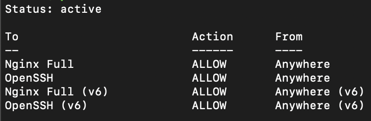
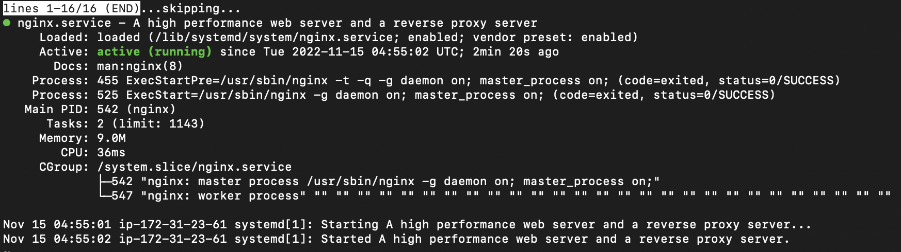

# Server Setup Example

Below are the basic steps needed to setup the server.

To access the server remotely using SSH via terminal or Command Prompt, run the command below:

```
ssh -i <your-server-key-file> <your-server-user>@<your-server-public-ip>
```

Example:

```
ssh -i key.pem ubuntu@123.12.12.12
```

## Web Server Installation

### 1. Nginx

- Install Nginx
  ```
  sudo apt install nginx
  ```
- Adjusting the firewall. The web server firewall is disabled by default. To enable the firewall, run the command below.
  ```
  sudo ufw enable
  ```
- Allow connections for port 80 (normal, unencrypted web traffic), port 443 (TLS/SSL encrypted traffic) and port 22 (default port for SSH).
  ```
  sudo ufw allow 'Nginx Full'
  ```
  ```
  sudo ufw allow 'OpenSSH'
  ```
- Verify the firewall changes by running the command below

  ```
  sudo ufw status
  ```

  The output is should looking like below

   

- Check whether the web server is already running or not.

  ```
  sudo systemctl status nginx
  ```

  You should see something like this:

   

- If it is already running, go to browser and enter the server's public IP address into the browser's address bar. You should see the default Nginx landing page.

  ```
  http://<your-server-public-ip>
  ```

  Run the command below to get your server's public IP:

  ```
  curl -4 icanhazip.com
  ```

- Next, create a new document root directory
  ```
  sudo mkdir -p /var/www/<your-domain-or-project-name>
  ```
- Assign ownership to the created directory
  ```
  sudo chown -R $USER:$USER /var/www/<your-domain-or-project-name>
  ```
- Grant permission to access the directory
  ```
  sudo chmod -R 755 /var/www/<your-domain-or-project-name>
  ```
- Create a sample html page for the site

  ```
  sudo nano /var/www/<your-domain-or-project-name>/index.html
  ```

- Copy and paste the code below into index.html file

  ```
  <html>
    <head>
        <title>Welcome!</title>
    </head>
    <body>
        <h1>Hello, World!</h1>
    </body>
  </html>
  ```

- Save and close the file by pressing `Ctrl+X`
- Create a server block or virtual host file to serve the content
  ```
  sudo nano /etc/nginx/sites-available/<your-domain-or-project-name>
  ```
- Paste the code below and press `Ctrl+X` to save the file

  ```
  server {
      listen 80;
      listen [::]:80;

      root /var/www/<your-domain-or-project-name>;
      index index.html index.htm index.nginx-debian.html;

      server_name <your-domain-name> www.<your-domain-name>;

      location / {
              try_files $uri $uri/ =404;
      }
  }
  ```

- Enable the server block and restart Nginx

  ```
  sudo ln -s /etc/nginx/sites-available/<your-domain-or-project-name> /etc/nginx/sites-enabled/
  ```

  ```
  sudo systemctl restart nginx
  ```

- Enable `server_names_hash_bucket_size` in nginx.conf file to avoid possible hash bucket memory problem

  ```
  sudo nano /etc/nginx/nginx.conf
  ```

  Find the `server_names_hash_bucket_size` directive and remove the '#' symbol to uncomment the line. Save and close the file by pressing `Ctrl+X`

- Run the command below to make sure there are no syntax errors in any of the Nginx files

  ```
  sudo nginx -t
  ```

- To enable the changes, restart Nginx.

  ```
  sudo systemctl restart nginx
  ```

- To test the results, go to browser and point to your server's public IP address. You should see the content that you have created.
